# E-commerce Data Warehouse

📌 Project Overview
This project implements a Kimball-style Data Warehouse for an E-commerce Platform using MySQL. It includes staging tables, dimension tables, and fact tables to store and analyze sales, reviews, and transaction data.

**TECHNOLOGIES**

🗄️ Database & Data Warehousing 
MySQL → Used for creating and managing the staging, dimension, and fact tables in the data warehouse.  
Kimball's Data Warehouse Methodology → Implemented a star schema for efficient querying and reporting.  

🔄 ETL (Extract, Transform, Load)  
SQL Queries → Used for data extraction, transformation, and loading (ETL) into the data warehouse.  
Data Cleaning & Preprocessing → Handled NULL values, data type conversions, and deduplication.  

📊 Business Intelligence & Data Visualization
Power BI → Designed interactive dashboards to analyze sales performance, customer behavior, and product reviews.  
DAX (Data Analysis Expressions) → Used in Power BI for KPI calculations and filtering data.  

📂 Version Control & Documentation
GitHub → Used for version control and project management.  
Markdown (README.md) → Documented project details, including ERD, SQL scripts, and Power BI dashboards.  

⚙️ Other Technologies & Concepts
Entity-Relationship Diagram (ERD) → Visualized data relationships.  
Data Modeling (Star Schema) → Structured data efficiently for reporting.  
SQL Joins & Indexing → Optimized query performance.  

**PROCESS**

📂 Database Structure
The database consists of two schemas:
raw_data → Contains staging tables for raw input data.
transformed_data → Stores cleaned and structured data for analytics.

📌 Staging Tables (raw_data)
staging_ecomm → Stores raw e-commerce transactions.
staging_reviews → Stores raw product review data.
staging_sales → Stores raw sales transaction data.

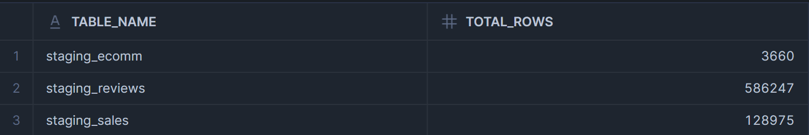

📌 Dimension Tables (transformed_data)
dim_users → Stores unique users.
dim_products → Stores unique products.
dim_payment_methods → Stores payment methods.
dim_sales_channel → Stores sales channels.
dim_fulfillment → Stores fulfillment types.

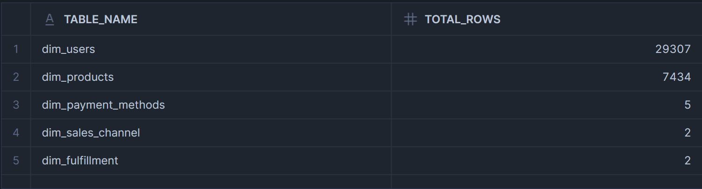

📌 Fact Tables (transformed_data)
fact_ecomm_sales → Stores processed e-commerce sales data.
fact_sales → Stores detailed transactional sales data.
fact_reviews → Stores product review data for analysis.

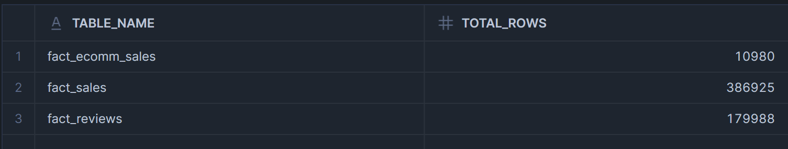

🔄 ETL Process
Extract raw data into staging tables.
Transform data using SQL queries (cleaning, deduplication, key mapping).
Load transformed data into dimension and fact tables.

Null values
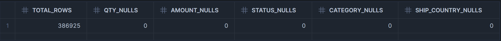

SELECT * FROM transformed_data.fact_ecomm_sales LIMIT 10;
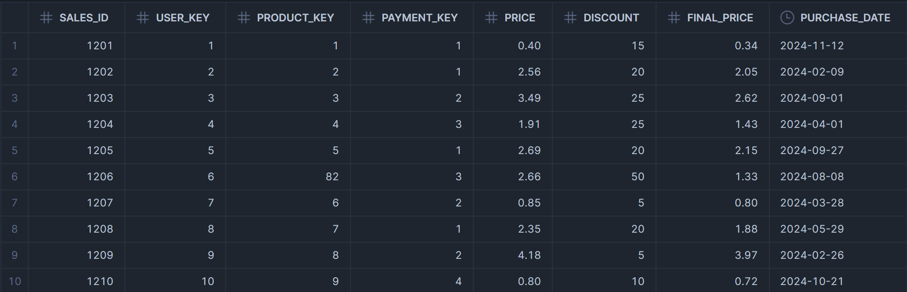

SELECT * FROM transformed_data.fact_sales LIMIT 10;
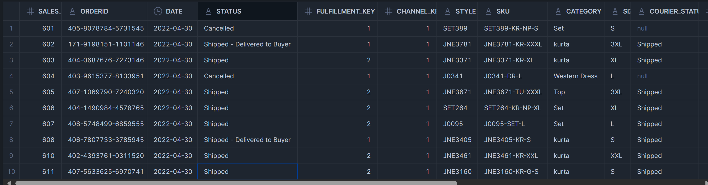

SELECT * FROM transformed_data.fact_reviews LIMIT 10;
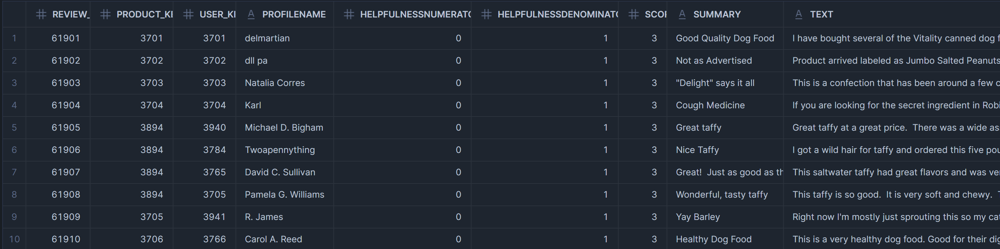

📊 Analytical Queries
Total Sales Per Category
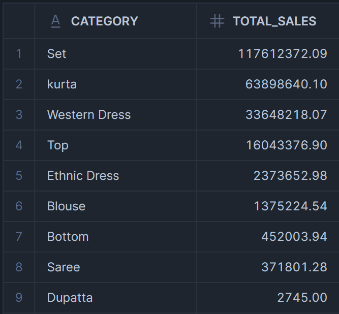

Average Review Score Per Product
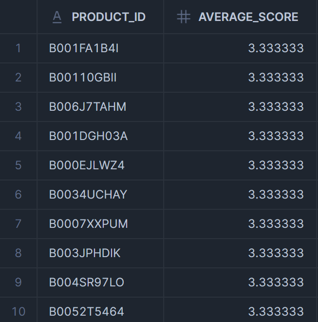

Total Sales by Payment Method
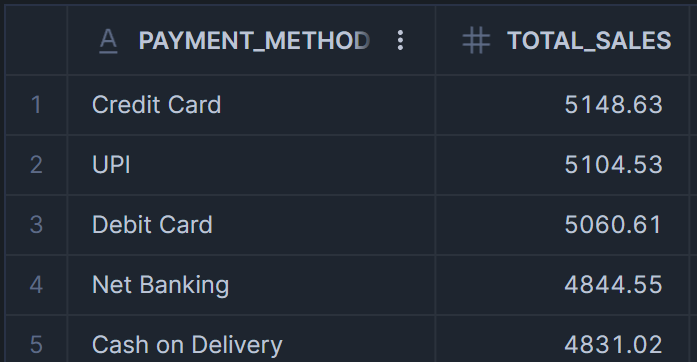

📈 Power BI Dashboards
1️⃣ Sales Performance Dashboard
📌 KPIs:
✔️ Total Revenue → SUM(fact_sales.amount)
✔️ Total Orders → COUNT(fact_sales.orderid)
✔️ Average Order Value → SUM(fact_sales.amount) / COUNT(fact_sales.orderid)

📌 Charts:
📊 Sales by Category → Bar Chart (category, SUM(amount))
🌍 Sales by Region → Map (ship_city, SUM(amount))
📉 Sales Trend Over Time → Line Chart (date, SUM(amount))

2️⃣ Customer Analytics Dashboard
📌 KPIs:
✔️ Total Customers → COUNT(DISTINCT dim_users.user_id)

📌 Charts:
💳 Preferred Payment Methods → Pie Chart (payment_method, SUM(final_price))

3️⃣ Product & Reviews Dashboard
📌 KPIs:
✔️ Total Products Sold → COUNT(fact_ecomm_sales.product_key)
✔️ Average Product Rating → AVG(fact_reviews.score)

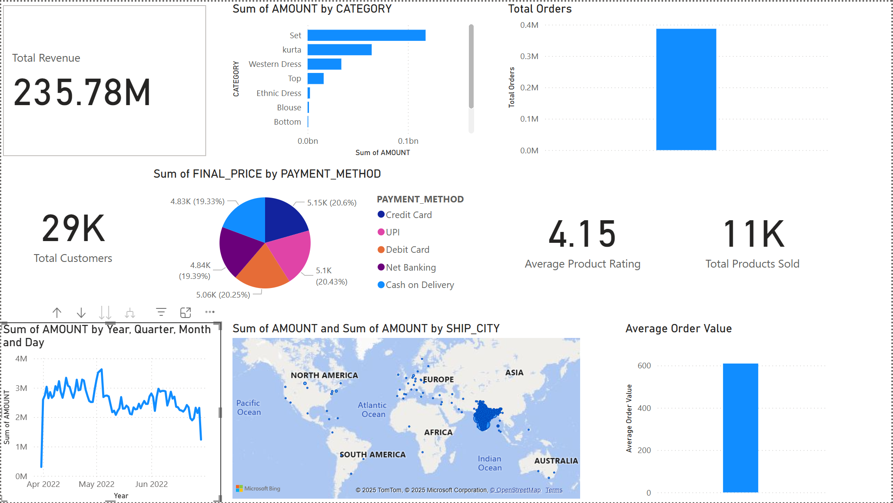

⚡ Installation & Usage
Clone the repository:

git clone https://github.com/utkarshgupta28/ecommerce-datawarehouse.git

Set up the database in MySQL:

CREATE DATABASE ecommerce_dw;

Run the provided SQL scripts to create schemas, tables, and load data.

📜 ERD (Entity Relationship Diagram)

