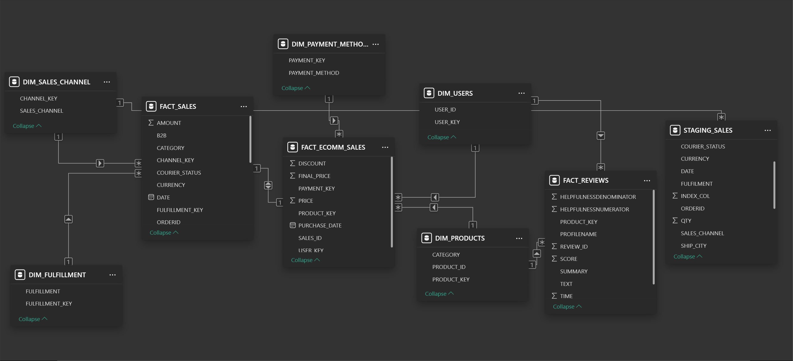

# E-commerce Data Warehouse

📌 Project Overview
This project implements a Kimball-style Data Warehouse for an E-commerce Platform using MySQL. It includes staging tables, dimension tables, and fact tables to store and analyze sales, reviews, and transaction data.

📂 Database Structure
The database consists of two schemas:
raw_data → Contains staging tables for raw input data.
transformed_data → Stores cleaned and structured data for analytics.

📌 Staging Tables (raw_data)
staging_ecomm → Stores raw e-commerce transactions.
staging_reviews → Stores raw product review data.
staging_sales → Stores raw sales transaction data.

📌 Dimension Tables (transformed_data)
dim_users → Stores unique users.
dim_products → Stores unique products.
dim_payment_methods → Stores payment methods.
dim_sales_channel → Stores sales channels.
dim_fulfillment → Stores fulfillment types.

📌 Fact Tables (transformed_data)
fact_ecomm_sales → Stores processed e-commerce sales data.
fact_sales → Stores detailed transactional sales data.
fact_reviews → Stores product review data for analysis.

🔄 ETL Process
Extract raw data into staging tables.
Transform data using SQL queries (cleaning, deduplication, key mapping).
Load transformed data into dimension and fact tables.

📊 Analytical Queries
Total Sales Per Category
Average Review Score Per Product
Total Sales by Payment Method

⚡ Installation & Usage
Clone the repository:

git clone https://github.com/utkarshgupta28/ecommerce-datawarehouse.git

Set up the database in MySQL:

CREATE DATABASE ecommerce_dw;

Run the provided SQL scripts to create schemas, tables, and load data.

📜 ERD (Entity Relationship Diagram)

