# E-commerce Data Warehouse

## 📌 Project Overview
The E-commerce Data Warehouse project is designed to optimize sales analysis, customer insights, and product performance tracking. It follows Kimball's Star Schema methodology to structure data efficiently for reporting and analytics. The project integrates Snowflake as the cloud data warehouse and Power BI for visualization, providing actionable insights into business performance.

## 🚀 Technologies Used
* Database & Data Warehousing: Snowflake, MySQL
* ETL (Extract, Transform, Load): SQL (Snowflake SQL), Data Cleaning, Transformation
* Business Intelligence & Visualization: Power BI, DAX (Data Analysis Expressions)
* Version Control & Documentation: GitHub, Markdown (README.md)
* Data Modeling: Kimball's Star Schema, ERD (Entity-Relationship Diagram)
* Performance Optimization: SQL Joins

## **PROCESS**

📂 Database Structure

The database consists of two schemas:
* raw_data → Contains staging tables for raw input data.
* transformed_data → Stores cleaned and structured data for analytics.

📌 Staging Tables (raw_data)
* staging_ecomm → Stores raw e-commerce transactions.
* staging_reviews → Stores raw product review data.
* staging_sales → Stores raw sales transaction data.

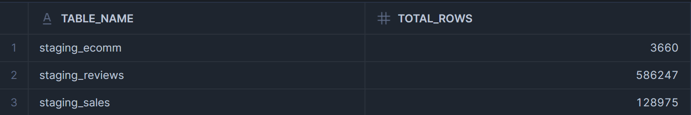

📌 Dimension Tables (transformed_data)
* dim_users → Stores unique users.
* dim_products → Stores unique products.
* dim_payment_methods → Stores payment methods.
* dim_sales_channel → Stores sales channels.
* dim_fulfillment → Stores fulfillment types.

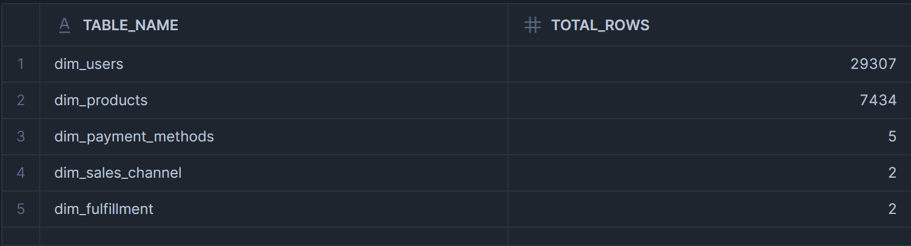

📌 Fact Tables (transformed_data)
* fact_ecomm_sales → Stores processed e-commerce sales data.
* fact_sales → Stores detailed transactional sales data.
* fact_reviews → Stores product review data for analysis.

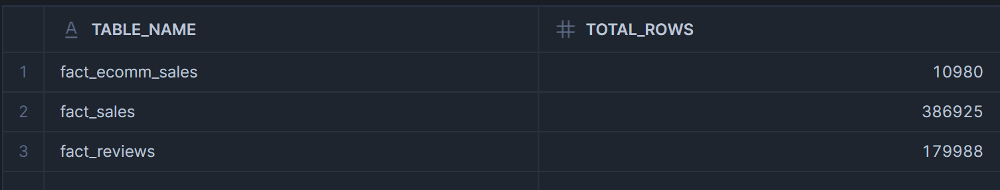

🔄 ETL Process
* Extract raw data into staging tables.
* Transform data using SQL queries (cleaning, deduplication, key mapping).
* Load transformed data into dimension and fact tables.

Null values
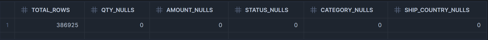

SELECT * FROM transformed_data.fact_ecomm_sales LIMIT 10;
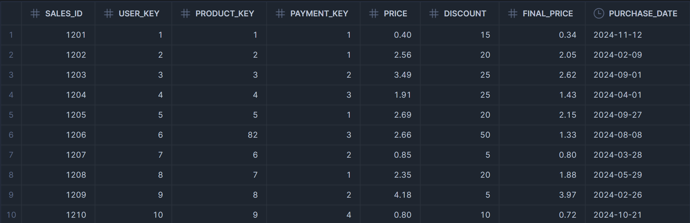

SELECT * FROM transformed_data.fact_sales LIMIT 10;
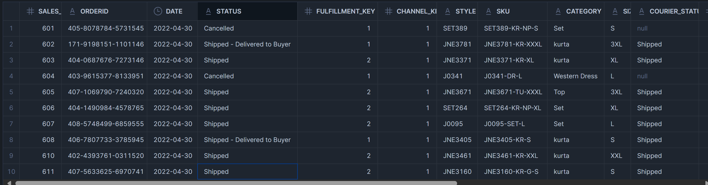

SELECT * FROM transformed_data.fact_reviews LIMIT 10;
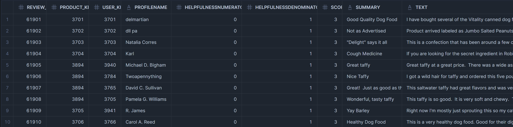

📊 Analytical Queries
* Total Sales Per Category
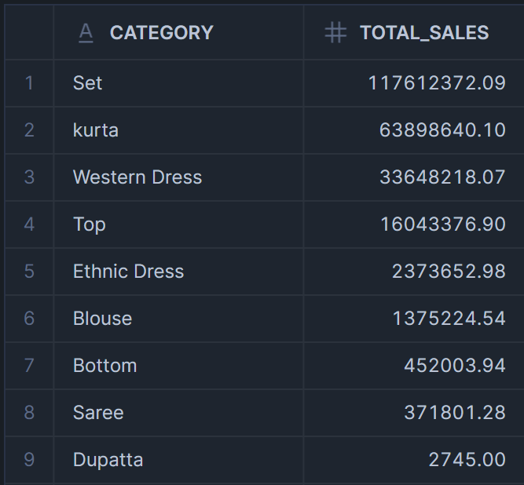

* Average Review Score Per Product
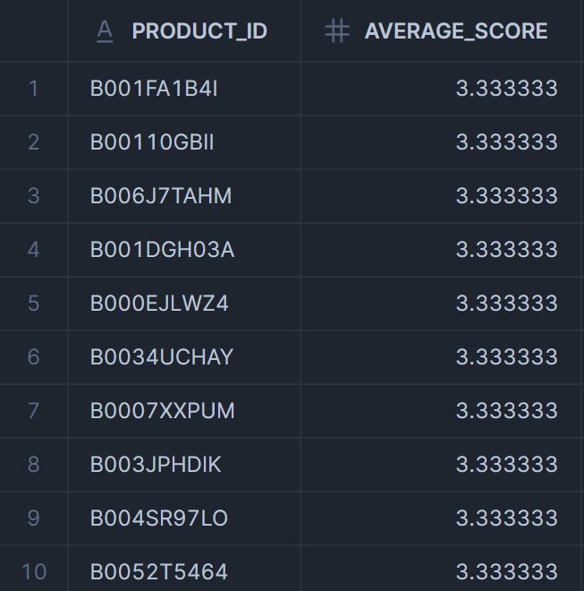

* Total Sales by Payment Method
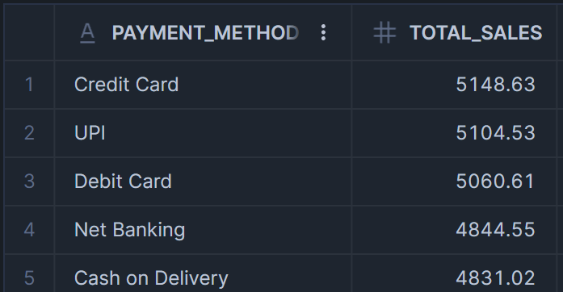

📈 Power BI Dashboards
1️⃣ Sales Performance Dashboard

📌 KPIs:
- Total Revenue → SUM(fact_sales.amount)
- Total Orders → COUNT(fact_sales.orderid)
- Average Order Value → SUM(fact_sales.amount) / COUNT(fact_sales.orderid)

📌 Charts:
- Sales by Category → Bar Chart (category, SUM(amount))
- Sales by Region → Map (ship_city, SUM(amount))
- Sales Trend Over Time → Line Chart (date, SUM(amount))

2️⃣ Customer Analytics Dashboard

📌 KPIs:
- Total Customers → COUNT(DISTINCT dim_users.user_id)

📌 Charts:
- 💳 Preferred Payment Methods → Pie Chart (payment_method, SUM(final_price))

3️⃣ Product & Reviews Dashboard

📌 KPIs:
- Total Products Sold → COUNT(fact_ecomm_sales.product_key)
- Average Product Rating → AVG(fact_reviews.score)

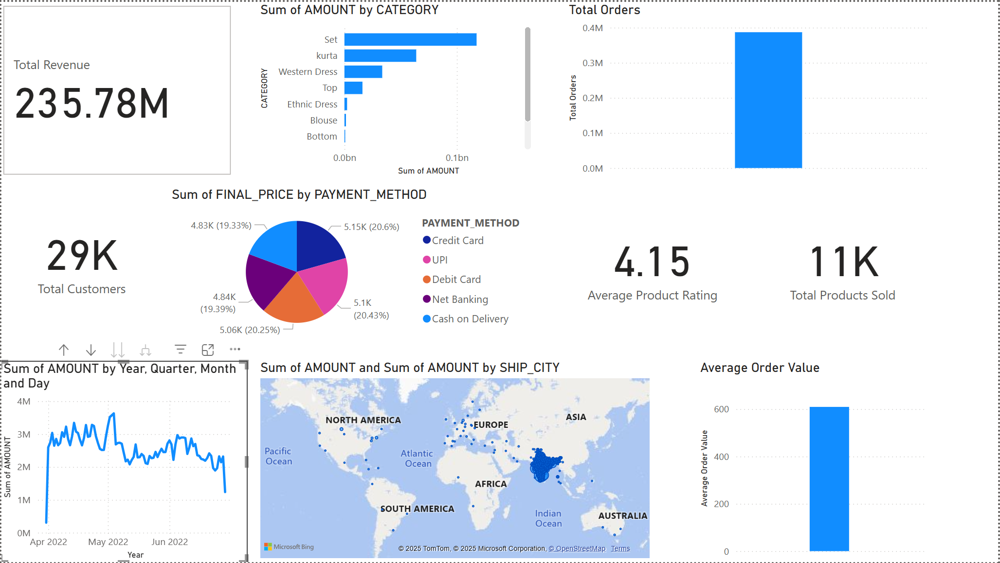

⚡ Installation & Usage
Clone the repository:

[git clone](https://github.com/utkarshgupta28/ecommerce-datawarehouse.git)

Set up the database in MySQL:

'CREATE DATABASE ecommerce_dw;'

Run the provided SQL scripts to create schemas, tables, and load data.

📜 ERD (Entity Relationship Diagram)

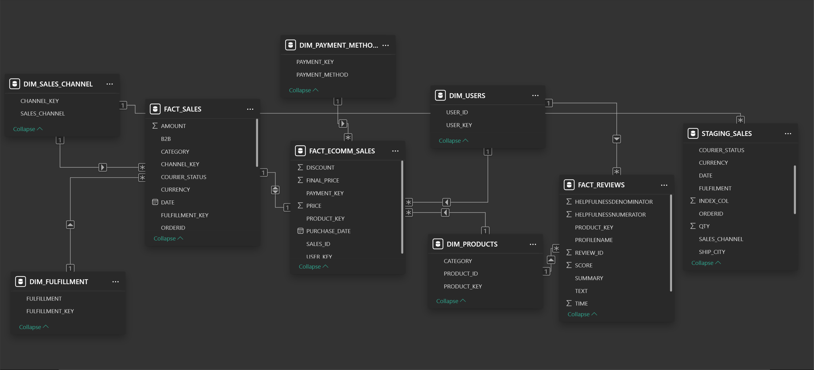

## Advanced SQL reporting automation

The repository now includes a production-style Snowflake reporting layer designed for Power BI:

- Three reusable reporting views with CTEs, window functions, ranking, customer segmentation, and fanout-safe aggregations
- An incremental `MERGE` stored procedure with validation, audit logging, row-count capture, query IDs, and failure handling
- Referential-integrity, required-field, negative-value, and duplicate checks
- A cold-cache baseline-versus-mart benchmark that records elapsed time and bytes scanned from Snowflake query history
- Dependency-free contract tests enforced by GitHub Actions

See [Advanced SQL reporting layer](docs/ADVANCED_SQL.md) for deployment, validation, and benchmarking instructions.

